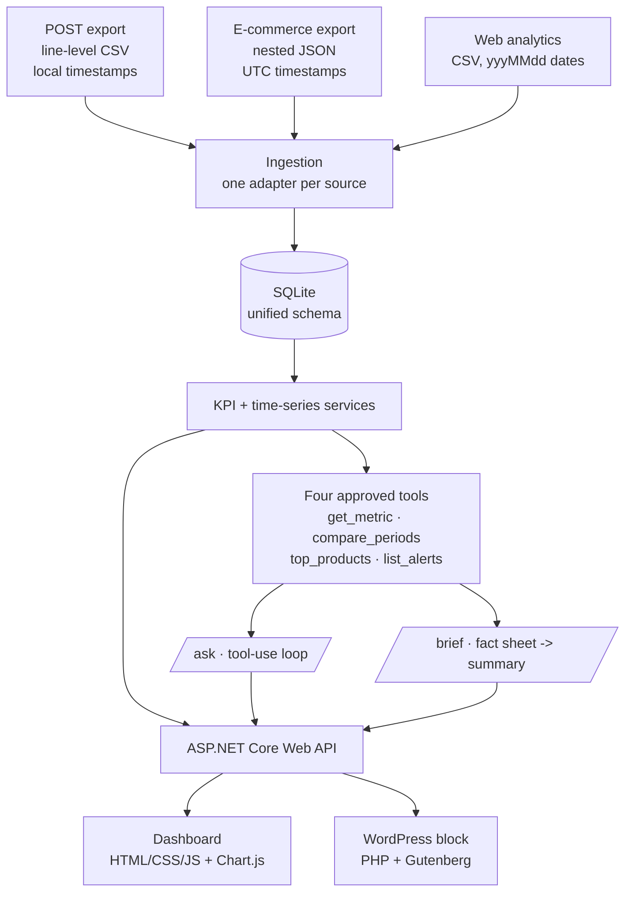

# Monday Brief

An AI-assisted KPI dashboard for a small retail business. It answers "how's the business doing?" three ways: a dashboard, a plain-English weekly brief, and a chat box that answers questions about your numbers without making any up.
 
 The AI never writes SQL and never sees the database. It calls a small set of approved C# functions, and **every figure in every answer has to come from one of those function results** - a constraint that is tested, not just intended.

 **Verified:** 96 unit and integration tests, plus a 31-check eval suite against a live model (31/31 passing, see [`eval-report.md`](eval-report.md)).

 Demo data is fictional: **Bayside Mercantile**, a gift shop and coffee counter with in-store and online sales, 12 months of generated data (35,328 orders, $830,736 revenue).

 ## What it does

 - **Dashboard** - revenue, orders, average order value and online conversion, each against the previous period; a daily revenue chart that splits by channel; best sellers and the products falling fastest.
- **Mondary brief** - a 120-160 word summary written from a fact sheet, not from the database, so it can only mention numbers that were computed for it.
- **Ask your data** - natural-language questions answered through tools calls, with a Sources line showing exactly which function produced each answer.
- **Alerts** - three threshold rules evaluated on demand: weekly revenue drop, online conversion below 2%, and per-product unit declines.

## Architecture



Each source system speaks a different dialect - line-level rows versus nested orders, local wall-clock time versus UTC, three different date formats, its own product IDs. Adapters normalize all of it to one shape: SKU as the product key, UTC timestamps plus a business date in the shop's time zone, and money as integer cents. Adding a new client system means writing one new adapter and changing nothing else.

## Running it

Requires the .NET 10 SDK.

```bash
./scripts/setup.sh                          # builds, generates data, creates the database 
dotnet run --project src/MondayBrief.Api    # http://localhost:5099
```

The dashboard works without an API key. For `/ask` and `/brief`:

```bash
dotnet user-secrets --project src/MondayBrief.Api set "Anthropic:ApiKey" "sk-ant-..."
```

**Live demo:** https://monday-brief.onrender.com - hosted on a free tier, so the first visit after a quiet spell takes about a minute to wake. Live questions need a passcode; the demo video shows in action.

## Testing

```bash
dotnet test             # 96 tests, no network, no API key needed
./scripts/evals.sh      # 31 live checks against the model (~$0.30, needs a key)
```

`dotnet test` covers CSV and JSON parsing, time-zone conversion, every KPI definition, alert rules, and the tool layer - including real-data tests that reconstruct all 35,328 orders from the raw exports and check the totals.

## How the AI is kept honest

Four things, in order of importance:

1. **The model has no database access.** It picks a tool name and arguments; C# runs the query. The worst a bad tool call can do is return an error message.
2. **Tools do all arithmetic.** `compare_periods` returns both values plus the change and percent change, so the model never subtracts anything itself.
3. **Tools round once, to display precision.** The model quotes what it was given rather than reformatting.
4. **The eval suite checks the result.** Every figure in every answer is extracted and matched against what the tools actually returned in that conversation. Questions the data can't answer must be declined.

Requests outside the data window (September 1, 2025 to August 30, 2026) are refused rather than silently returning zeros - a quiet zero would let the model report a collapse that never happened.

## Generating the demo data

`src/MondayBrief.Seed` writes the three raw exports from a fixed seed, with five events planted so there is something real to find:

| Event | When | Why it's there |
|---|---|---|
| Mardi Gras spike | Feb 2026 | Seasonal peak with a sharp end on Ash Wednesday |
| Storm closure | Aug 12-13, 2026 | Store closed, website still selling - shows the channel split |
| Holiday ramp | Nov-Dec 2025 | Black Friday, shipping cutoff, post-Christmas drop |
| Declining product | Jun-Aug 2026 | Down 48% in four weeks while total revenue moves only -3.5% |
| Conversion drop | From Jul 13, 2026 | Conversion falls from 2.4% to 1.6% with sessions flat |

The generator verifies its own output: 18 checks confirm each event is findable and unambiguous, written to [`data/raw/SEED_CHECK.md`](data/raw/SEED_CHECK.md). That file is also the answer key the tests assert against.

The declining product is the point of the whole demo. Headline revenue is down 3.5%, which an owner would shrug at. One product is down 48%, and the dashboard and the AI both find it.

## Accessibility

WCAG 2.1 Level AA, verified by keyboard walkthrough, Lighthouse, and a screen-reader pass. Details in [`accessibility.md`](accessibility.md).

## Decisions worth explaining

- **Money as integer cents.** SQLite has no decimal type, and cents never drift.
- **Ranges end on the last complete day.** "Last 30 days" excludes today, so a partial day never drags an average down.
- **Conversion is Σ orders ÷ Σ sessions**, never an average of daily rates - averaging would give a quiet Tuesday the same weight as Black Friday.
- **Product decline rankings need a 60-unit baseline.** Without a floor, a product that sold 3 units last month and 1 this month is "down 67%" and drowns out real signal.
- **Alerts are computed, not stored.** No events table to keep in sync, and no risk of stale rows.
- **Ingestion is idempotent**, enforced by a unique index on (source system, external ID). Running it twice can't double your revenue.

## Limits

- The data is fictional and generated. It's realistic in shape, but it isn't a real business.
- The eval suite measures 31 questions I wrote against data I generated. It shows the grounding design works on the cases I anticipated, not that the system is correct in general.
- Evals were run against Claude Haiku 4.5. Other models would need their own run.
- Single-tenant: one business, one dataset, no authentication on the dashboard.
- Designed and tested over one weekend.
- The deployed demo serves a fixed snapshot of the database. Live questions are passcode-gated to keep API costs at zero.

## Layout

```

src/MondayBrief.Core        Entities, adapters, KPI services, tools, AI layer
src/MondayBrief.Api         Web API and dashboard
src/MondayBrief.Seed        Demo data generator with self-checks
tests/MondayBrief.Evals     Unit tests and the live eval suite
wordpress/                  Gutenberg block plugin
data/raw                    Generated source exports (committed for reproducibility)
```
